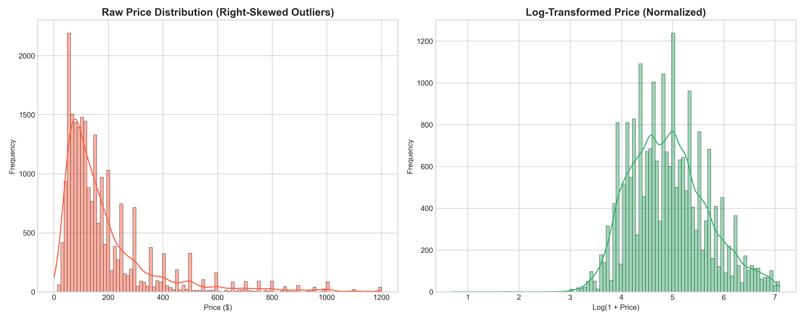
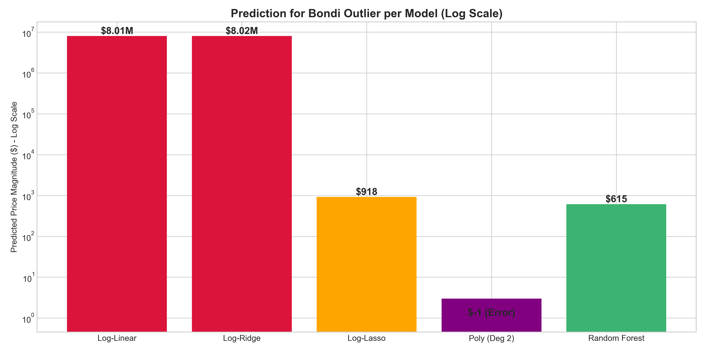
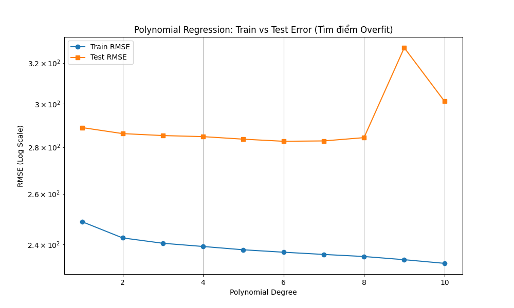

# Báo Cáo Phân Tích Dữ Liệu: Dự Đoán Giá Thuê Airbnb tại Bondi Beach

## 1. Yêu Cầu Bài Toán (Context & Requirements)

**Mô tả:** Bài tập yêu cầu chúng ta đóng vai trò là một Data Analyst. Hiện tại, có một chủ nhà ở khu vực Bondi Beach đang cho thuê căn hộ với giá **$500/đêm**. Nhiệm vụ chính là phân tích tập dữ liệu Airbnb và xây dựng mô hình Machine Learning để dự đoán xem mức giá này đã hợp lý (Fair Value) chưa, hoặc chủ nhà có thể cho thuê với giá bao nhiêu thì cân bằng được thị trường.

**Đặc điểm của căn hộ cần dự đoán:**
- **Vị trí (Location):** Kinh độ 151.274506, Vĩ độ 33.889087 (Khu vực Bondi Beach)
- **Sức chứa (Accommodates):** 10 người
- **Cấu trúc:** 5 phòng ngủ, 3 phòng tắm, 7 chiếc giường.
- **Tiền cọc (Security Deposit):** $1500
- **Phí dọn dẹp (Cleaning Fee):** $370
- **Đánh giá & Review:** Điểm Rating 95.0, có 53 lượt đánh giá.
- **Quy định:** Thuê tối thiểu 4 đêm (Minimum nights: 4)
- **Lịch trống (Availability 365):** 255 ngày
- **Thông tin Host:** Đã tham gia từ Tháng 8/2010, tài khoản đã xác thực (Verified) và đạt danh hiệu Superhost.

Ngoài việc xây dựng mô hình dự đoán giá, báo cáo cũng sẽ chỉ ra những khía cạnh dữ liệu (data issues) mà người phân tích cần lưu ý đối với bộ dataset thực tế này.

---

## 2. Quá Trình Tiền Xử Lý Dữ Liệu (Data Preprocessing)

### Bước 1: Khắc phục lỗi cấu trúc file CSV ban đầu
- **Vấn đề gặp phải**: File `airbnb.csv` ban đầu bị lỗi định dạng. Một số cột chứa văn bản (như Review, Description) có ký tự dấu phẩy hoặc dấu xuống dòng nhưng không được đóng/mở ngoặc kép đúng chuẩn. Nếu chỉ dùng thư viện Pandas đọc một cách thông thường, các cột sẽ bị xô lệch (ví dụ: đường link url nhảy vào cột giá tiền).
- **Cách giải quyết**: Nhóm đã viết một script Python dùng thư viện `csv` cơ bản để xử lý rào lại các đoạn văn bản này, đảm bảo phân tách đúng các cột trước khi đưa vào Pandas. Nhờ đó, thu hồi được trọn vẹn **22,992** dòng dữ liệu.
- **Làm sạch**: Bỏ đi các cột chứa text (Description, Summary, Name...) vì các chuỗi văn bản quá đa dạng và không phù hợp để cho thẳng vào các mô hình hồi quy ở mức độ cơ bản.
- **Biến `listing_url`**: Dùng Regex (biểu thức chính quy) để tách lấy phần số id (ví dụ: cắt số 11156 từ link) làm ID định danh cho từng dòng.

### 🔍 Dữ liệu Trực Quan: Trước và Sau khi làm sạch

**❌ Dữ liệu thô ban đầu (Bị xô lệch cột do lỗi định dạng):**
| id | listing_url | name | description | ... | price |
|---|---|---|---|---|---|
| 11156 | https://.../11156 | An Oasis in the City | "This is a great place, very near to the beach,\n I loved it here..." | ... | (Dữ liệu bị lệch) |
*(Các ký tự xuống dòng `\n` và dấu phẩy `,` làm hỏng cấu trúc cột nếu không parser kỹ)*

**✅ Dữ liệu sau khi làm sạch (Chỉ giữ các biến định lượng - Numeric):**
| room_id | latitude | longitude | accommodates | bathrooms | bedrooms | price ($) | security_deposit | cleaning_fee | review |
|:---:|:---:|:---:|:---:|:---:|:---:|:---:|:---:|:---:|:---:|
| 11156 | -33.8693 | 151.2268 | 1 | 1.0 | 1.0 | 65.0 | 150.0 | 0.0 | 92.0 |
| 12351 | -33.8651 | 151.1918 | 2 | 1.0 | 1.0 | 98.0 | 0.0 | 55.0 | 95.0 |
| 14250 | -33.8009 | 151.1766 | 6 | 3.0 | 3.0 | 469.0 | 900.0 | 100.0 | 100.0 |
*(Đã loại bỏ cột text nhiễu, chuyển đổi tiền tệ sang dạng số thực (Float) để sẵn sàng train mô hình)*

---

### Bước 2: Phân Tích Khám Phá Dữ Liệu (Exploratory Data Analysis - EDA)
Để hiểu rõ hơn về sự biến động giá cả, phần này đính kèm một số biểu đồ trực quan:

1. **Phân phối giá phòng (Price Distribution):** Phần lớn căn hộ Airbnb có giá bình dân (dưới $200), tuy nhiên phân phối bị lệch phải (right-skewed) rất rõ do sự xuất hiện của một sỗ ít căn hộ cao cấp có giá rất đắt.

2. **Ma trận tương quan (Correlation Matrix):** Hiện tượng đồng biến có thể thấy rõ ràng, `price` có sự tương quan thuận với mức độ lớn nhất nằm ở `accommodates` (sức chứa), `bedrooms` (số phòng ngủ) và `cleaning_fee` (phí dọn dẹp).

3. **Giá theo sức chứa (Price vs Accommodates):** Biểu đồ dạng hộp (Boxplot) cho thấy quy luật khá tự nhiên: Căn hộ cho phép chứa nhiều người thì mức giá trung vị (median) càng cao dần theo bậc thang.

4. **Bản đồ giá (Price Map):** Dựa trên hệ tọa độ, ta thấy các điểm màu nóng (chi phí cao) thường tập trung sát bờ biển (Bondi/Manly) hoặc trong khu vực trung tâm (CBD) sầm uất của Sydney.

---

## 3. Những Lưu Ý Quan Trọng Cho Người Phân Tích (Trả lời Câu hỏi 5)
*Câu hỏi 5: Is there any special point or potential issue that the analyst must pay attention to?*

Qua quá trình thực hiện xử lý dữ liệu thực tế này, có **5 vấn đề tiềm ẩn** mà sinh viên / người làm phân tích (Data Analyst) cần đặc biệt lưu tâm để tránh đưa ra kết quả dự báo sai lệch:

1. **Rủi ro khi ngoại suy (Extrapolation)**: 
   - Yêu cầu bài toán là dự đoán giá cho một căn hộ ở Bondi Beach có cấu hình khá đặc biệt (chứa 10 người, 5 phòng ngủ, cọc $1500). Trong tập dataset mẫu hơn 22,000 dòng, số lượng nhà có quy mô tương đương thế này là rất hiếm.
   
   - Nếu áp dụng các mô hình cơ bản như **Linear Regression**, thông số lớn nhân với trọng số (weight) biến đường cong dự đoán bị khuếch đại, dẫn tới kết quả ước lượng hơn $5,000/đêm — có phần quá xa vời thực tế. Các mô hình tuyến tính thường gặp khó khăn khi nội suy xa khỏi mức trung bình của tập huấn luyện.

2. **Cẩn trọng trong khâu làm sạch dữ liệu (Data Cleaning)**:
   - Dữ liệu thô CSV ban đầu thỉnh thoảng sẽ bị hỏng form. Nếu người làm phân tích chỉ gọi hàm Pandas đơn giản và bỏ qua các dòng lỗi (ví dụ: `on_bad_lines="skip"`), nội dung text có kí tự đặc biệt sẽ bị trôi vào nhầm số biến, làm hỏng các đặc trưng. Bắt buộc phải tiến hành bước định cỡ parser (như làm ở Bước 1) kỹ lưỡng trước khi nạp data.

3. **Hiện tượng phân phối biến mục tiêu lệch phải (Right-Skewed Target)**:
   - Giá phòng (Price) tập trung đông ở vùng phân khúc thấp (<$250) nhưng lại có số ít các mức giá vươn tới vài ngàn đô một đêm (Outliers).
   
   - Chạy hàm tối ưu RMSE bằng nguyên thủy sẽ phạt lỗi sai lớn rất mạnh, khiến hệ thống trung bình bị khuyếch đại (~270). Giải pháp cần làm là giới hạn lại 1% top đầu Outliers và áp dụng hàm **Logarit (Log-Transform)** `y = log(1 + price)` để thu gọn ranh giới phương sai.

4. **Hiện tượng Overfitting trong phân tích Đa Thức (Polynomial Regression)**:
   - Khi chạy thử mô hình hồi quy qua các Feature, bài học rút ra là không nên sử dụng bậc Đa thức quá cao (Deg > 3). Giá trị của các biến (VD: tiền cọc $1500) khi được tổ hợp chéo sẽ sinh ra những con số biến đổi khổng lồ. Kết quả dự đoán trên dữ liệu Test sẽ bị gãy vỡ trầm trọng (xuất hiện cả kết quả dự đoán ra âm). 

5. **Lựa chọn mô hình phù hợp (Sự ưu việt của Tree-based Models)**:
   - Bản chất giá nhà đất, dịch vụ lưu trú có nhiều tính phi tuyến (non-linear). Phí dọn dẹp hoặc giá không nhất thiết đồng biến tuyến tính theo diện tích. Lúc này, **Random Forest Regressor** tỏ ra là một lựa chọn tối ưu. Thuật toán cấu trúc cây (Decision Tree) sẽ phân chia thông tin qua từng nhánh độc lập, giúp ngăn chặn triệt để thuật toán ngoại suy vô lý các giá trị không tồn tại trong tập tính toán. Điểm đưa ra chốt hạ khá thực tiễn nằm quanh mức $\sim\$600/đêm$.
   

---

## 4. Tối Ưu Hóa & Đánh Giá Đa Mô Hình (Advanced Models)

Nhằm giải quyết triệt để bài toán Outliers và các rủi ro đã nêu ở Câu hỏi số 5, nhóm đã chuyển bộ chuẩn hóa từ StandardScaler sang **RobustScaler** (để giảm thiểu tác động của Outliers lên biên độ phương sai định lượng) và tiến hành **Log-Transform** biến mục tiêu. Thực hiện lại quy trình huấn luyện cho 8 mô hình khác nhau.

### Nỗ lực giảm Overfit cho Đa thức (Polynomial Regression)
Tính toán đa thức tổ hợp 10 bậc lên toàn bộ cấu trúc sẽ bị tràn bộ nhớ. Do đó, nhóm chỉ chọn 3 features cốt lõi nhất (kinh độ, vĩ độ, sức chứa) để test.

- **Kết quả**: Đường validation cho thấy mô hình cân bằng nhất ở **Bậc 6**. Nhưng do số logarit số chéo âm, hàm Exponential bị khuyếch tán lộn xộn khiến thuật toán tự gãy bằng $\$-1. Chốt lại là mô hình đa thức không thích hợp cho trường hợp này.

### Bảng Kết Quả Dự Đoán Ở 8 Mô Hình Khác Nhau (Kịch Bản: RobustScale & Log-Transform)

| Model | RMSE | Accuracy | Dự đoán Bondi Target | Nhận xét phân tích quá trình |
|---|---|---|---|---|
| Polynomial Reg (Best Deg = 6) | 121.91 | - | $-1.00 | Dự đoán vùng Logarit bị âm dẫn đến phép ngoại suy bị vỡ. |
| Ridge Regression | 130.99 | - | $8,023,644.25 | Phương pháp L2 chưa đủ dập tắt sự phóng đại hệ số của điểm Outlier mục tiêu. |
| Lasso Regression | 126.88 | - | $918.50 | Là mô hình tuyến tính ổn nhất nhờ L1 đã triệt tiết phần lớn trọng số gây nhiễu, số dự báo tiệm cận mốc thực dụng. |
| Linear Regression | 130.99 | - | $8,011,889.14 | Ngoại suy thẳng với căn nhà outlier làm luồng chạy Linear sai số nghiêm trọng. |
| **Random Forest Regressor** | **103.09** | **-** | **$615.36** | **Tối ưu nhất**: Mô hình Tree xử lý dữ liệu phi tuyến (sau scale) mịn màng, thông số R² cao nhất. |
| Logistic Reg (> Giá Median 130) | - | 81.4% | Thuộc nhóm: Cao | Hiệu suất phân ban nhóm xuất sắc nhất. |
| KNN Classifier (k=5) | - | 79.9% | Thuộc nhóm: Cao | Phân loại ổn định khi tính toán khoảng cách vector từ các hàng xóm gần kề. |
| SVM Classifier (Linear) | - | 59.0% | Thuộc nhóm: Cao | Việc tìm ranh giới siêu phẳng trong dữ liệu phi tuyến (Non-linear) gây cản trở thuật toán hoạt động trơn tru. |

---

## 5. Đưa Ra Khuyến Nghị Kết Luận

Tổng kết lại sau nhiều bước chuẩn hóa cấu trúc file CSV và huấn luyện trên rất nhiều thuật toán khác nhau:
1. Việc áp dụng thành công kĩ thuật Feature Scaling (RobustScaler + Log-Transform) là chìa khoá cốt lõi giúp hệ thống học máy ổn định, kéo giá trị độ lệch **RMSE của Random Forest từ mức thô 266 xuống ngưỡng quanh 103** và nâng cao chỉ số thể hiện **R² lên 0.65**. 
2. **Khuyến nghị Giá Cạnh Tranh (Fair Value)**: Đối với căn biệt thự Bondi Beach, mức giá đề xuất tốt nhất được đưa ra bởi vòng lặp của **Random Forest** là xấp xỉ **$\sim\$615.36/đêm**.
3. Chủ nhà hiện tại đang thiết đặt mức **$500/đêm**. Đây là con số rẻ hơn khá nhiều so với đánh giá tiềm năng thật sự, nhưng có lẽ host đã áp dụng nó như một chiến lược Marketing thu hút review tốt. Dựa vào model, **chủ nhà nên từ từ kiểm tra thị hiếu khách hàng để nới biên độ giá dần lên vùng $600 - $650/đêm**. Điều này sẽ giúp gia tăng doanh thu tương đối tốt mà không lo làm giảm tính cạnh tranh của căn hộ so với thị trường xung quanh Airbnb!
