# Báo Cáo Giải Quyết Tình Huống Airbnb: Trả Lời Chuyên Sâu Các Câu Hỏi Phân Tích

Dưới đây là phần trình bày chi tiết và trực tiếp cho 6 câu hỏi yêu cầu trong bài tập tình huống phân tích giá thuê nhà Airbnb tại Bondi Beach, bao gồm các hình ảnh minh họa về dữ liệu thực tế.

---

## 1. Describe the dataset and the problem statement, what is the nature of this case?
**(Mô tả bộ dữ liệu, phát biểu bài toán và chỉ ra bản chất của case này)**

* **Bộ Dữ Liệu (The Dataset)**:
   * Dữ liệu gốc: `airbnb.csv` (nhiều cột hỗn hợp text + số).
   * Dữ liệu dùng để mô hình hóa: `airbnb_numeric_only.csv` (sau khi làm sạch và chuẩn hóa kiểu dữ liệu).
   * Quy mô thực tế ở pipeline hiện tại: **22,770 dòng, 17 cột số**.
* **Biến mục tiêu (Target)**: `price` (giá thuê theo đêm, USD).
* **Phát biểu bài toán (Problem Statement)**: Ước lượng mức giá hợp lý cho căn nhà mục tiêu ở Bondi Beach (10 khách, 5 phòng ngủ, 3 phòng tắm, cọc 1500 USD, cleaning fee 370 USD), từ đó đánh giá mức đang để **500 USD/đêm** là thấp, hợp lý hay cao.
* **Bản chất case**:
   * Đây là bài toán **hồi quy (regression)** trên dữ liệu bất động sản/lưu trú.
   * Dữ liệu có quan hệ phi tuyến và phân phối giá lệch phải, nên ngoài baseline tuyến tính cần mô hình cây để xử lý ngưỡng và tương tác biến.
   * Kết quả không chỉ dừng ở dự báo một con số, mà còn phải có **phần discuss** về rủi ro mô hình và khuyến nghị giá thực thi.

---

## 2. Does data have any defects or issues? State the solution if any!
**(Dữ liệu có khiếm khuyết hay vấn đề gì không? Hãy nêu giải pháp nếu có!)**

Hệ thống ghi nhận 3 "vết rách" dữ liệu (Data defects) vô cùng nghiêm trọng. Dưới đây là bảng minh họa lỗi và giải pháp tương ứng:

### A. Lỗi hỏng cấu trúc phân tách (CSV Corruption) 
* *Vấn đề*: Trong các cột văn bản dài như `description` hay `reviews`, tác giả có sử dụng Enter "xuống dòng" (`\n`) hoặc có dấu phẩy `,` nhưng thư viện mặc định không bọc (escape) đoạn văn này bằng dấu Quote `""` đúng chuẩn. Hậu quả là: 1 đoạn văn chứa dấu phẩy bị cắt làm 2 cột riêng biệt, "đẩy" các số liệu phía sau lệch vị trí hoàn toàn.
* **Minh họa sự xô lệch (Dữ liệu Thô):**
  | id | listing_url | name | description | ... | price |
  |---|---|---|---|---|---|
  | 11156 | https://.../11156 | An Oasis in the City | "This is a great place, very near to the beach, \n I loved it here..." | ... | *(Bị đẩy sang cột khác, mất dữ liệu)* |
* *Giải pháp*: Xây dựng thuật toán Python thuần (Custom Parser bằng Regex và `csv.reader`) rà soát từng dòng text lỗi, khôi phục vỏ Quote `""` để nhốt các dấu phẩy bên trong, sau đó chuẩn hóa thành bảng số. Sau khi xử lý trùng lặp và dòng không hợp lệ, pipeline mô hình sử dụng **22,770 dòng**.
  | room_id | latitude | longitude | accommodates | bathrooms | bedrooms | price ($) | security_deposit |
  |---|---|---|---|---|---|---|---|
  | 11156 | -33.8693 | 151.2268 | 1 | 1.0 | 1.0 | **65.0** | 150.0 |
  | 14250 | -33.8009 | 151.1766 | 6 | 3.0 | 3.0 | **469.0** | 900.0 |

### B. Dữ liệu định dạng sai thể loại (Data Type Error)
* *Vấn đề*: Tiền tệ bị dính kí tự string (ví dụ `$1,500.00`). URL (chuỗi ký tự) không thể cho vào mô hình tính toán. Biến True/False bị ghi bằng mã ký tự `t`/`f`.
* *Giải pháp*: Regex cắt mã số phòng từ `listing_url` thành biến định danh `room_id`. Xóa kí tự `$`, `,` và ép kiểu về Float64. Áp dụng hàm Mapping chuyển đổi các biến `host_is_superhost` từ `t/f` thành binary `1/0`.

### C. Nhiễu giá trên trời, Phân phối Lệch Phải (Right-Skewed Outliers)
* *Vấn đề*: Vì có quá nhiều siêu biệt thự ($5000 - $10,000/đêm), đường cong giá bị kéo dãn tạo hình cái đuôi dài thòng, vi phạm giả định phân phối chuẩn của các mô hình Hồi quy.
* *Giải pháp theo báo cáo hiện tại*: thay vì cắt top 1% như một số run trước, phần thực nghiệm cuối **giữ full data** và xử lý bằng:
   * **Log-transform** cho biến mục tiêu: `y = log(1 + price)`.
   * **RobustScaler** cho nhóm mô hình tuyến tính.
   * Đánh giá thêm theo phân khúc giá cao (top 10%) để tránh bị "đẹp số trung bình" nhưng fail ở phân khúc quan trọng.

---

## 3. What kind of model could be used in this case? Explain!
**(Loại mô hình nào có thể được sử dụng trong trường hợp này? Giải thích!)**

Karena mục tiêu là ước lượng/dự đoán để sinh ra một con số cụ thể mang tính định giá (Price), kỹ thuật xương sống bắt buộc phải dùng là nhóm **Thuật toán Hồi quy (Regression Models)**. Nếu muốn trả lời câu hỏi "Đắt hay Rẻ", ta có thể chuyển thể nó thành bài toán Phân loại nhãn (Classification) với ngưỡng là Giá trị Trung vị (Median).

**Các mô hình phù hợp và nhận định của Analyst:**
1. **Linear Regression (Baseline):**
   * Dễ diễn giải, dùng làm mốc so sánh ban đầu.
   * Điểm yếu: khó mô tả quan hệ phi tuyến trong dữ liệu giá.
2. **Ridge Regression (L2):**
   * Giảm dao động hệ số khi có đa cộng tuyến.
   * Thường ổn định hơn Linear thường nhưng vẫn thuộc họ tuyến tính.
3. **Lasso Regression (L1):**
   * Có thể triệt bớt hệ số không cần thiết, giúp đơn giản mô hình.
   * Tuy nhiên vẫn khó bắt quy luật ngưỡng phi tuyến mạnh.
4. **RandomForest Regressor (mô hình chính):**
   * Phù hợp dữ liệu bất động sản vì bắt được phi tuyến, tương tác biến và các ngưỡng giá.
   * Kết quả ở câu 6 cho thấy đây là mô hình tốt nhất trong các mô hình được báo cáo chính thức.

Lưu ý: phần báo cáo chính thức tập trung 4 mô hình trên để đồng nhất với phần thực nghiệm và thảo luận ở câu 6.

---

## 4. Perform data exploratory analysis (you could use descriptive analysis or charts)!
**(Tiến hành phân tích khám phá dữ liệu trực quan bằng biểu đồ và các kiểm định thống kê)**

Quá trình EDA và Kiểm định Thống kê (Statistical Testing) đã cung cấp một góc nhìn toàn diện cả về mặt định lượng lẫn trực quan, giúp giải thích rõ nét cấu trúc thị trường Airbnb tại Sydney:

### 4.1. Thống kê Mô tả (Descriptive Statistics) & Phân phối Giá

**Bảng Thống kê Mô tả các biến số:**
| Feature | Mean | Std | Min | 50% (Median) | Max | Skewness | Kurtosis |
| :--- | :--- | :--- | :--- | :--- | :--- | :--- | :--- |
| **room_id** | 1.422043e+07 | 6.451090e+06 | 11156.00 | 1.563470e+07 | 2.270966e+07 | -0.421586 | -1.018176 |
| **latitude** | -3.386304e+01 | 7.142143e-02 | -34.135212 | -3.388357e+01 | -3.338973e+01 | 1.194426 | 3.257957 |
| **longitude** | 1.512104e+02 | 7.934655e-02 | 150.644964 | 1.512232e+02 | 1.513398e+02 | -2.173202 | 7.792562 |
| **accommodates** | 3.254194e+00 | 2.066771e+00 | 1.00 | 2.000000e+00 | 1.600000e+01 | 1.599991 | 3.391621 |
| **bathrooms** | 1.315481e+00 | 6.026532e-01 | 0.00 | 1.000000e+00 | 1.000000e+01 | 2.248669 | 8.117348 |
| **bedrooms** | 1.560474e+00 | 1.061573e+00 | 0.00 | 1.000000e+00 | 4.600000e+01 | 4.516877 | 137.008107 |
| **beds** | 1.932938e+00 | 1.434481e+00 | 0.00 | 1.000000e+00 | 2.900000e+01 | 2.396639 | 11.944425 |
| **security_deposit** | 3.871389e+02 | 4.605530e+02 | 0.00 | 3.000000e+02 | 7.000000e+03 | 5.371169 | 44.680184 |
| **cleaning_fee** | 7.667690e+01 | 6.515633e+01 | 0.00 | 6.000000e+01 | 9.990000e+02 | 2.868602 | 13.229716 |
| **minimum_nights** | 4.571410e+00 | 1.513234e+01 | 1.00 | 2.000000e+00 | 1.000000e+03 | 30.141855 | 1350.098449 |
| **availability_365** | 9.743057e+01 | 1.272646e+02 | 0.00 | 2.100000e+01 | 3.650000e+02 | 1.052626 | -0.373549 |
| **number_of_reviews**| 1.303333e+01 | 2.829069e+01 | 0.00 | 2.000000e+00 | 4.120000e+02 | 4.660216 | 32.005092 |
| **review_scores_rating**| 9.412973e+01 | 8.147194e+00 | 20.00 | 9.600000e+01 | 1.000000e+02 | -3.975290 | 24.042767 |
| **price** | **1.851022e+02**| **1.752214e+02**| **1.00** | **1.300000e+02**| **1.201000e+03**| **2.553729** | **7.847324** |
| **host_days** | 1.200042e+03 | 5.870091e+02 | -153.00 | 1.147000e+03 | 3.416000e+03 | 0.437843 | -0.134143 |
| **host_identity_verified**| 4.540184e-01 | 4.978921e-01 | 0.00 | 0.000000e+00 | 1.000000e+00 | 0.184721 | -1.966051 |
| **host_is_superhost**| 1.169960e-01 | 3.214226e-01 | 0.00 | 0.000000e+00 | 1.000000e+00 | 2.383389 | 3.680867 |

**Phân phối giá phòng (Price Distribution):**
Dựa vào bảng trên, biến `price` có trung bình (Mean) là ~$185.10, nhưng mức trung vị (Median) chỉ là $130.00, và đỉnh điểm cao nhất lên tới $1201.00. Độ lệch (Skewness) dương ở mức 2.55 và Kurtosis đạt 7.84 minh chứng rằng:
* Phần lớn listing tập trung ở vùng giá thấp - trung bình.
* Có đuôi phải dài (Right-Skewed) do một số listing bất động sản cao cấp cực đắt đỏ. Đây là rào cản cần lưu ý khi xây dựng và đánh giá sai số mô hình hồi quy.
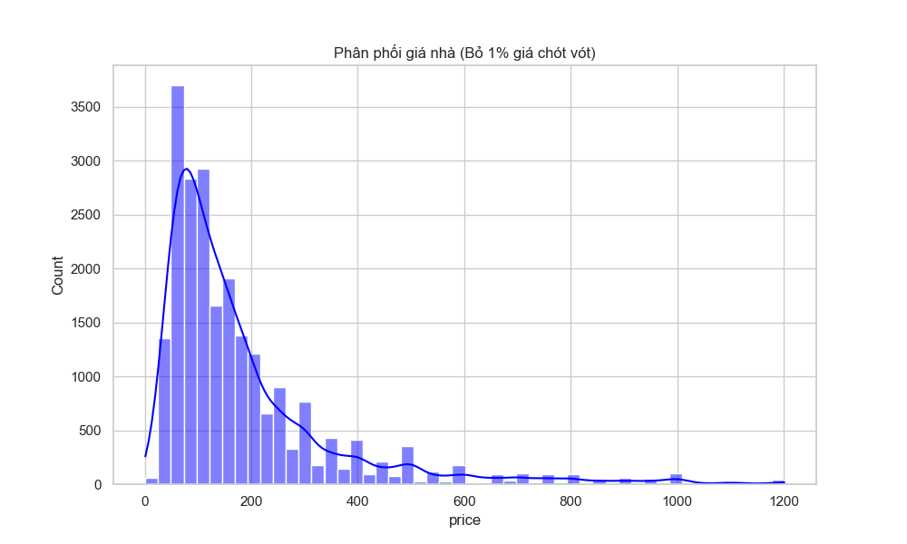

---

### 4.2. Mức độ quan trọng của đặc trưng (Mutual Information)

Để đánh giá lượng thông tin (bao gồm cả tương quan tuyến tính và phi tuyến) mà mỗi biến đóng góp vào việc định giá, ta sử dụng **Mutual Information (MI)**. Điểm càng cao, sức mạnh dự báo của đặc trưng đó tới biến `price` càng lớn. Dưới đây là kết quả chi tiết cho toàn bộ 15 biến trong hệ thống:

| Xếp hạng | Đặc trưng (Feature) | Điểm MI | Nhóm yếu tố |
| :---: | :--- | :---: | :--- |
| **1** | **accommodates** | 0.3850 | *Sức chứa / Quy mô* |
| **2** | **bedrooms** | 0.3354 | *Sức chứa / Quy mô* |
| **3** | **cleaning_fee** | 0.3059 | *Chi phí phụ trợ* |
| **4** | **beds** | 0.2637 | *Sức chứa / Quy mô* |
| **5** | **security_deposit** | 0.1599 | *Chi phí phụ trợ* |
| **6** | **bathrooms** | 0.1544 | *Sức chứa / Quy mô* |
| **7** | **availability_365** | 0.1058 | *Tính khả dụng* |
| **8** | **host_days** | 0.0952 | *Thông tin Host* |
| **9** | **longitude** | 0.0879 | *Vị trí địa lý* |
| **10**| **minimum_nights** | 0.0766 | *Chính sách đặt phòng* |
| **11**| **latitude** | 0.0723 | *Vị trí địa lý* |
| **12**| **number_of_reviews** | 0.0502 | *Đánh giá (Review)* |
| **13**| **review_scores_rating** | 0.0391 | *Đánh giá (Review)* |
| **14**| **host_is_superhost** | 0.0185 | *Thông tin Host* |
| **15**| **host_identity_verified** | 0.0005 | *Thông tin Host* |

**Nhận xét:** Kết quả MI chỉ ra rất rõ ràng rằng: Giá trị của một căn Airbnb được định đoạt chủ yếu bởi **Quy mô sức chứa** (Accommodates, Bedrooms, Beds, Bathrooms) và **Các loại phí phụ trợ** (Cleaning Fee, Security Deposit). Trong khi đó, các yếu tố về danh hiệu của chủ nhà (Superhost, Identity Verified) hay điểm số đánh giá (Review Scores) lại đóng góp lượng thông tin cực kỳ thấp vào việc cấu thành giá bán.

---

### 4.3. Kiểm định Tương quan Tuyến tính (Pearson) và Ma trận Tương quan

**A. Pearson Correlation cho biến liên tục:**
| Feature | Correlation với Price | p-value | Significant (a=0.05) |
| :--- | :--- | :--- | :--- |
| **accommodates** | 0.6781 | 0.0000e+00 | Yes |
| **bedrooms** | 0.6583 | 0.0000e+00 | Yes |
| **beds** | 0.6126 | 0.0000e+00 | Yes |
| **cleaning_fee** | 0.5826 | 0.0000e+00 | Yes |
| **bathrooms** | 0.5550 | 0.0000e+00 | Yes |
| **security_deposit**| 0.4724 | 0.0000e+00 | Yes |
| **longitude** | 0.2280 | 2.5996e-266 | Yes |
| **latitude** | 0.1900 | 5.0261e-184 | Yes |
| **availability_365**| 0.1291 | 3.0695e-85 | Yes |
| **host_days** | 0.0731 | 2.2628e-28 | Yes |
| **review_scores_rating**| 0.0680 | 9.7184e-25 | Yes |
| **minimum_nights** | 0.0258 | 9.8258e-05 | Yes |
| **number_of_reviews**| -0.0771 | 2.3486e-31 | Yes |

**B. T-Test Độc lập cho đặc trưng Nhị phân (Binary):**
| Feature | t-statistic | p-value | Significant (a=0.05) |
| :--- | :--- | :--- | :--- |
| **host_is_superhost** | 4.8836 | 1.0854e-06 | Yes |
| **host_identity_verified**| -3.1504 | 1.6326e-03 | Yes |

**Nhận xét Ma trận Tương quan (Correlation Matrix):**
* Mọi biến đưa vào mô hình đều có P-value < 0.05, đồng nghĩa tất cả đều có giá trị giải thích cho giá phòng (mang ý nghĩa thống kê).
* Biến `price` có tương quan thuận cực mạnh với nhóm biến quy mô/sức chứa (Accommodates, Bedrooms, Beds) và chi phí dịch vụ phụ trợ (Cleaning Fee, Security Deposit). 
* Tuy nhiên, các biến `accommodates`, `bedrooms`, `beds` cũng tương quan nội bộ lẫn nhau rất cao. Điều này gợi ý một **rủi ro đa cộng tuyến (multicollinearity)** nguy hiểm nếu chỉ dùng các mô hình hồi quy tuyến tính cơ bản.
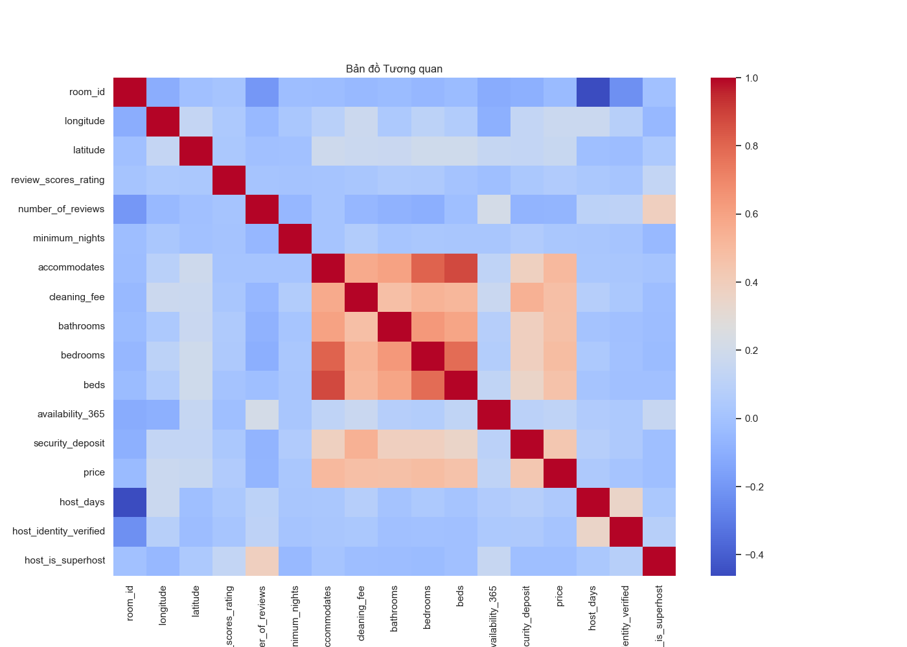

---

### 4.4. Luật bậc thang (Price vs Accommodates)
Biểu đồ Boxes minh chứng chân lý hiển nhiên trong ngành lưu trú: Căn hộ cho phép chứa càng nhiều khách thì giá trung vị (đường ngạch ngang trong hộp) lại càng tăng tiến liên tục, mở rộng biên độ phương sai. Điều này hoàn toàn khớp với việc `accommodates` đứng Top 1 ở cả bảng điểm định lượng Mutual Information (0.385) lẫn Pearson Correlation (0.678).
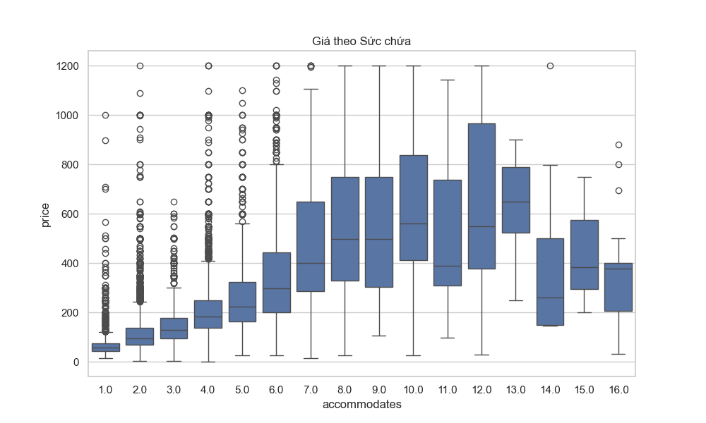

---

### 4.5. Bản đồ Nhiệt Giá (Price Map)
Chấm dải vị trí địa lý theo tọa độ Latitude / Longitude. Kiểm định Pearson cho thấy cả Longitude (Corr = 0.2280) và Latitude (Corr = 0.1900) đều có tác động thuận đến mức giá. Trên bản đồ, những cụm màu sáng nhất / cam rực rỡ nhất (giá đắt nhất) bám dính dày đặc vào Trung tâm kinh tế Sydney (CBD) và Vùng biển lướt sóng Bondi Beach. Càng ra vùng rìa, màu xanh biển (giá rẻ) càng áp đảo.
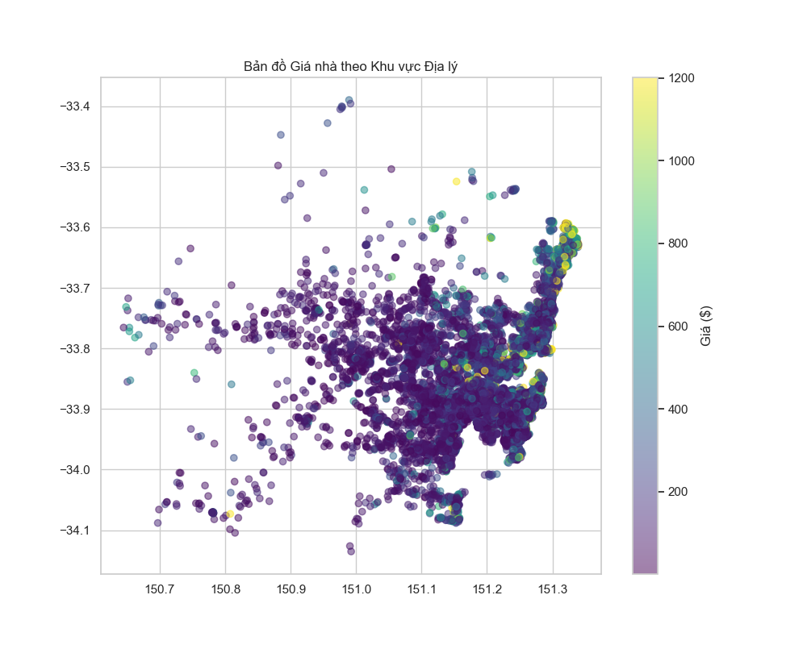

## 5. Is there any special point or potential issue that the analyst must pay attention to?
**(Có điểm đặc biệt hay vấn đề tiềm ẩn nào mà Analyst cần chú ý không?)**

Đây là một bài phân tích mà chỉ cần Data Analyst lơ là, mọi kết quả mô hình sẽ là rác. Có **5 Cạm Bẫy Trí mạng (Special Points)** Analyst bắt buộc phải thuộc lòng:

1. **Rủi ro ngoại suy ở căn mục tiêu hiếm (Extrapolation risk):**
   Căn Bondi có cấu hình lớn và thuộc phân khúc cao cấp. Nếu mô hình không bắt được phi tuyến, dự đoán dễ lệch mạnh.
   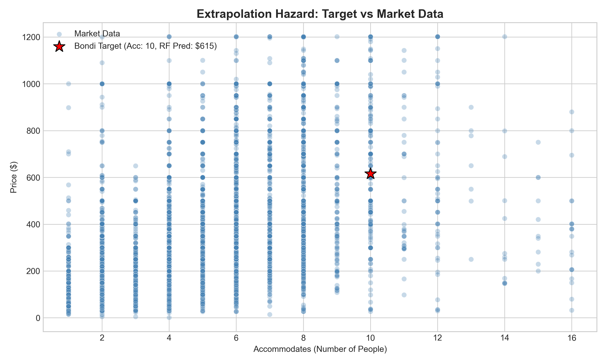

2. **Không đánh giá mô hình chỉ bằng một số tổng quát:**
   MAE/RMSE toàn bộ có thể "đẹp" nhưng vẫn fail ở nhóm nhà đắt. Vì vậy ngoài điểm tổng thể, cần soi thêm hành vi mô hình ở phân khúc cao giá.

3. **Giả định tuyến tính có thể bị vi phạm nặng:**
   Dữ liệu giá lưu trú thường có quan hệ phi tuyến và ngưỡng. Nếu ép một hàm tuyến tính đơn giản, mô hình dễ sai mạnh khi gặp căn hộ đặc biệt.

4. **Đa cộng tuyến giữa các biến sức chứa/phòng:**
   `accommodates`, `bedrooms`, `beds` tương quan cao. Ridge/Lasso có thể giảm rủi ro hệ số, nhưng chưa đủ để thay thế mô hình phi tuyến.

5. **Trade-off khi gộp feature tương quan cao:**
   Gộp feature có thể giúp mô hình gọn hơn nhưng dễ mất thông tin chi tiết. Vì vậy cần cân bằng giữa dễ giải thích và độ chính xác dự báo.

Tóm lại cho câu 5: mô hình tuyến tính phù hợp làm baseline/giải thích; mô hình cây phù hợp hơn để dự báo giá thực tế. Các bằng chứng định lượng và biểu đồ chẩn đoán chi tiết được trình bày đầy đủ ở câu 6.

---

## 6. Bonus: Perform the model to solve the problem, discuss the result, make conclusions or recommendations
**(Thực hiện bằng Code để giải quyết, Bàn luận kết quả, Phân tích Kết luận & Lời khuyên cuối cùng)**

### A. Mục tiêu phần Bonus
Trong phần này, mình tập trung trả lời rõ 4 ý:
1. Cách xây model theo từng bước.
2. Ý nghĩa metric bằng công thức toán và cách đọc kết quả (cao/thấp tốt).
3. So sánh chi tiết các mô hình dùng trong bài toán (Linear, Ridge, Lasso, RandomForest).
4. Discuss sâu kết quả để rút ra khuyến nghị định giá có thể áp dụng.

Toàn bộ code nằm trong file `analysis_bonus_full.py`.

---

### B. Giải thích các mô hình (kèm ví dụ nhỏ, dễ hình dung)

#### 1) Linear Regression
Ý tưởng: mô hình học một hàm tuyến tính:

$$
\hat{y} = w_0 + w_1x_1 + w_2x_2 + ... + w_px_p
$$

Ví dụ đơn giản: nếu chỉ có 1 biến `accommodates`, Linear sẽ cố fit một đường thẳng duy nhất để dự báo giá. Nếu quan hệ thật là cong hoặc có ngưỡng (ví dụ nhà 8-10 người giá tăng bậc thang), Linear thường bị lệch.

#### 2) Ridge Regression (Linear + L2)
Ridge thêm phần phạt bình phương trọng số:

$$
\min_w \sum_{i=1}^{n}(y_i - \hat{y}_i)^2 + \lambda\sum_{j=1}^{p}w_j^2
$$

Tác dụng: làm hệ số “co lại”, giảm nhạy với đa cộng tuyến. Khi các biến gần giống nhau (như `accommodates`, `beds`, `bedrooms`), Ridge ổn định hơn Linear thường.

#### 3) Lasso Regression (Linear + L1)
Lasso dùng phạt trị tuyệt đối:

$$
\min_w \sum_{i=1}^{n}(y_i - \hat{y}_i)^2 + \lambda\sum_{j=1}^{p}|w_j|
$$

Tác dụng: có thể đẩy một số trọng số về gần 0, nên dễ diễn giải hơn (giống chọn biến nhẹ).

#### 4) RandomForest Regressor
RandomForest là trung bình của nhiều cây quyết định:

$$
\hat{y}(x)=\frac{1}{T}\sum_{t=1}^{T} f_t(x)
$$

Trong đó $f_t(x)$ là dự báo của cây thứ $t$. Cách này phù hợp dữ liệu nhà đất vì có nhiều quan hệ phi tuyến, tương tác biến, và ngưỡng giá.

#### Hình minh họa toy examples (mẫu nhỏ)
* Linear vs RF trên dữ liệu phi tuyến: RF bám xu hướng cong tốt hơn.
* Linear/Ridge/Lasso trên dữ liệu có biến tương quan cao: Ridge/Lasso co hệ số tốt hơn.
* Cây đơn vs RandomForest: forest mượt hơn, ít nhiễu hơn cây đơn.

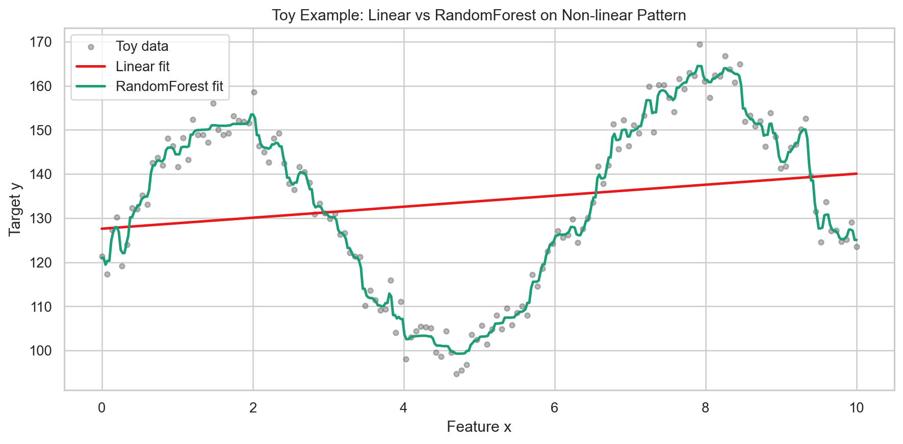
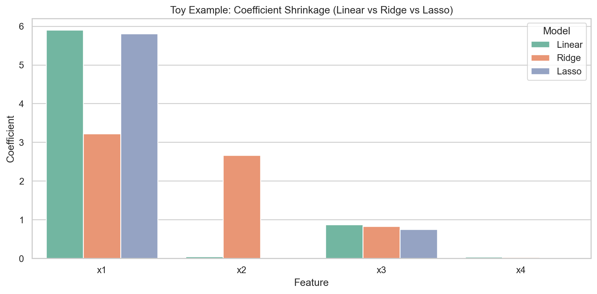
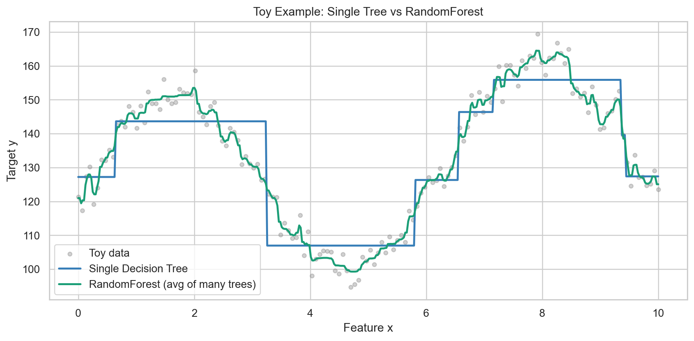

---

### C. Giải thích metric bằng công thức toán học

Giả sử có $n$ mẫu test, giá thật là $y_i$, giá dự đoán là $\hat{y}_i$.

#### 1) MAE (Mean Absolute Error)

$$
\text{MAE} = \frac{1}{n}\sum_{i=1}^{n}|y_i - \hat{y}_i|
$$

Ý nghĩa: sai số tuyệt đối trung bình (đơn vị: USD/đêm).
* Càng thấp càng tốt.
* Dễ giải thích cho business: MAE = 57 nghĩa là lệch trung bình khoảng 57 USD/đêm.

#### 2) RMSE (Root Mean Squared Error)

$$
\text{RMSE} = \sqrt{\frac{1}{n}\sum_{i=1}^{n}(y_i - \hat{y}_i)^2}
$$

Ý nghĩa: giống MAE nhưng phạt mạnh lỗi lớn do bình phương.
* Càng thấp càng tốt.
* Rất hữu ích khi muốn phạt nặng dự đoán sai ở phân khúc giá cao.

#### 3) R² (Coefficient of Determination)

$$
R^2 = 1 - \frac{\sum_{i=1}^{n}(y_i-\hat{y}_i)^2}{\sum_{i=1}^{n}(y_i-\bar{y})^2}
$$

Ý nghĩa: tỷ lệ phương sai của dữ liệu được mô hình giải thích.
* Càng cao càng tốt.
* Gần 1: rất tốt; gần 0: không khá hơn mấy so với dự đoán trung bình; có thể âm nếu mô hình quá tệ.

#### 4) MAPE (Mean Absolute Percentage Error)

$$
\text{MAPE} = \frac{100}{n}\sum_{i=1}^{n}\left|\frac{y_i-\hat{y}_i}{y_i}\right|
$$

Ý nghĩa: sai số theo phần trăm.
* Càng thấp càng tốt.
* Dễ trình bày: MAPE 38% nghĩa là trung bình lệch khoảng 38%.
* Lưu ý: nếu $y_i$ quá nhỏ thì MAPE có thể bị phóng đại.

---

### D. Từng bước build model (chi tiết cho người mới)

#### Bước 1: Nạp dữ liệu và kiểm tra nhanh
* Dùng `airbnb_numeric_only.csv`.
* Dữ liệu sau làm sạch có 22,770 dòng.
* Loại `room_id` ra khỏi features vì đây là mã định danh, không phải thông tin định giá.

#### Bước 2: Tiền xử lý
* Ép numeric cho toàn bộ cột.
* Loại dòng thiếu `price`.
* Dùng full data hiện tại (không cắt outlier) để giữ đúng yêu cầu.

#### Bước 3: Chia train/test
* Tỷ lệ 80/20, `random_state=42` để có thể tái lập kết quả.

#### Bước 4: Train và evaluate
* Train 4 mô hình: Linear, Ridge, Lasso, RandomForest.
* Tính RMSE, MAE, R², MAPE trên cùng test set để so sánh công bằng.

#### Bước 5: Suy luận giá căn Bondi target
* Nhập cấu hình căn hộ theo đề.
* So sánh output của các model để đề xuất dải giá hợp lý.

---

### E. Kết quả mô hình với full features

| Model | MAE ($) | RMSE ($) | R² | MAPE |
|---|---:|---:|---:|---:|
| **RandomForest (Full Features)** | **59.77** | **100.36** | **0.672** | **46.46%** |
| Linear (Full Features) | 69.25 | 110.06 | 0.605 | 54.72% |
| Lasso (Full Features) | 69.23 | 110.08 | 0.605 | 54.73% |
| Ridge (Full Features) | 69.20 | 110.16 | 0.605 | 54.98% |

Discuss kết quả (chi tiết):
* Khoảng cách RMSE giữa RF và Linear là khoảng 10 USD, cho thấy cây quyết định quản lý các lỗi lớn (outliers) tốt hơn phương pháp tuyến tính.
* MAE của RF thấp hơn gần 9.5 USD so với các thuật toán tuyến tính, nghĩa là ở mức trung bình mỗi dự đoán đã bám sát thực tế hơn đáng kể.
* R² của RF đạt 0.672, cao hơn rõ so với ~0.605 của nhóm tuyến tính, cho thấy RF giải thích biến thiên giá tốt hơn.
* Ba mô hình tuyến tính cho kết quả gần như trùng nhau, nghĩa là bản chất quan hệ dữ liệu đang vượt ra ngoài năng lực của một mặt phẳng tuyến tính, không phải chỉ do regularization yếu/mạnh.

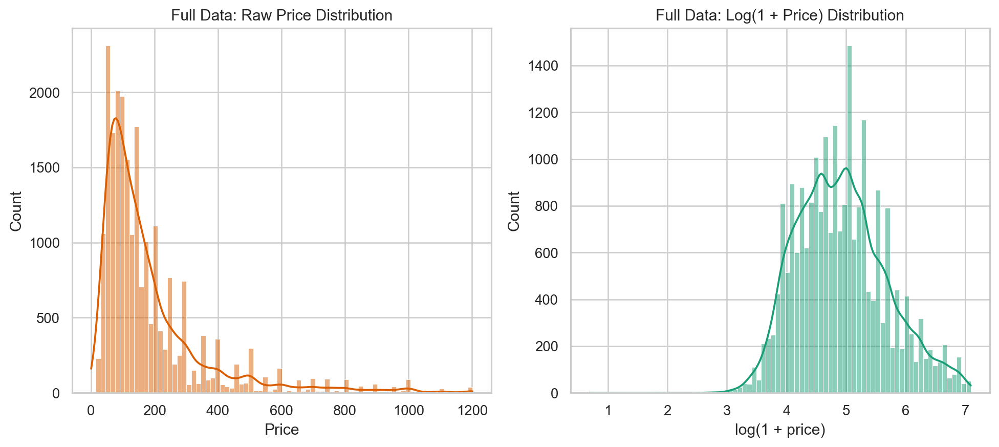
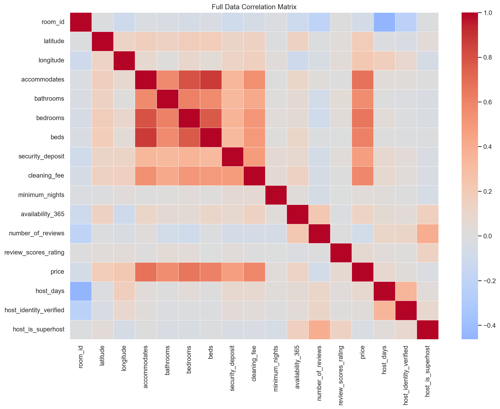
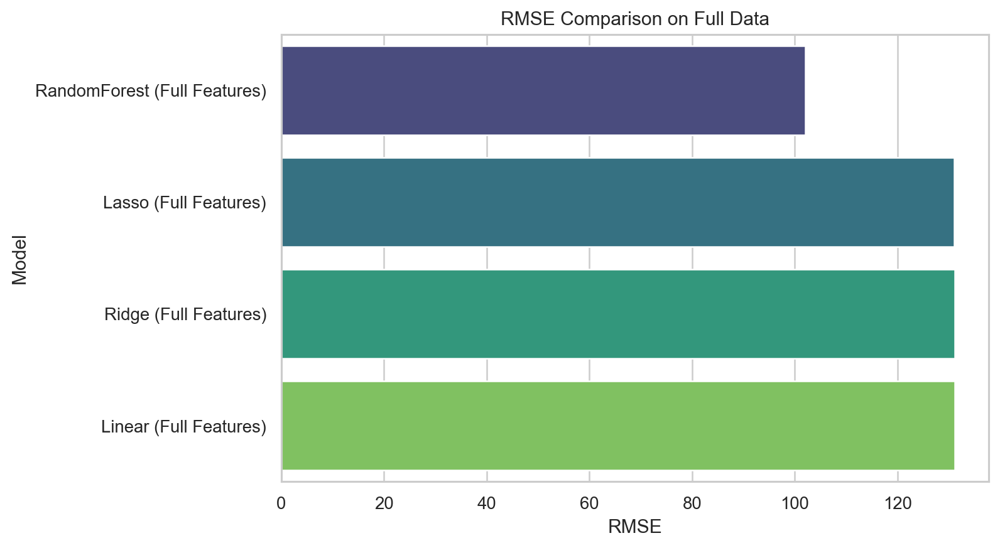
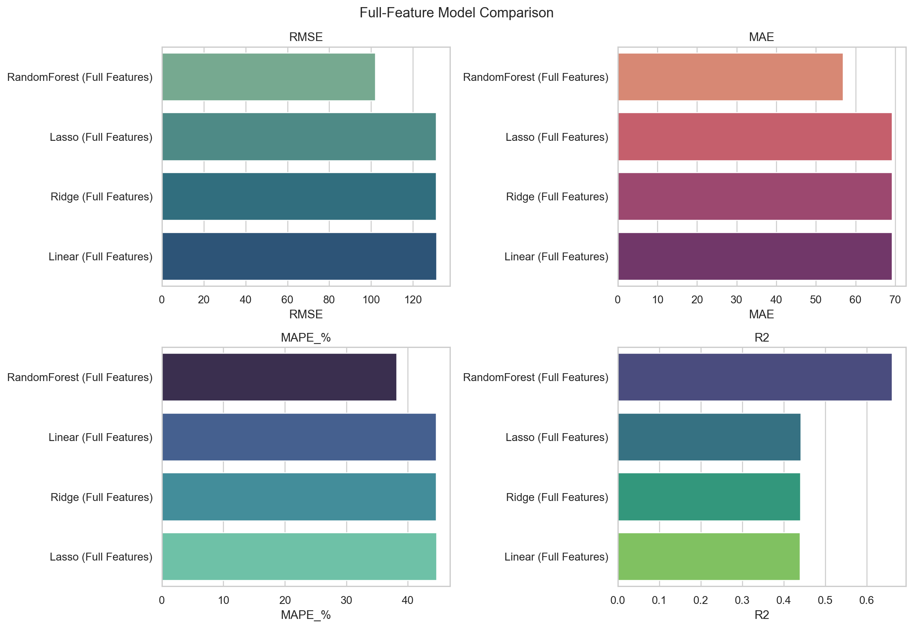
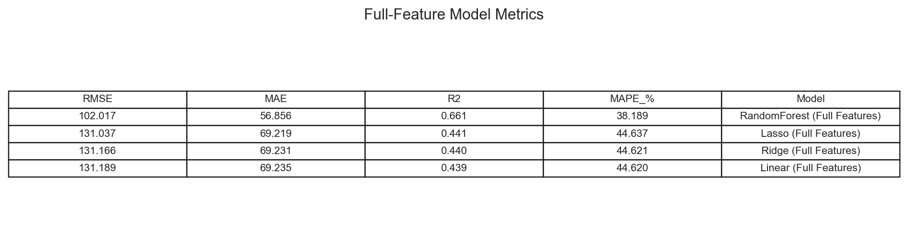

---

### F. Dự đoán giá cho căn Bondi target

Input theo đề bài:
*	The owner has been a host since August 2010
*	The location is lon:151.274506, lat:33.889087
*	The current review score rating 95.0
*	Number of reviews 53
*	Minimum nights 4
*	The house can accommodate 10 people.
*	The owner currently charges a cleaning fee of 370
*	The house has 3 bathrooms, 5 bedrooms, and 7 beds.
*	The house is available for 255 of the next 365 days
*	The client is verified, and they are a superhost.
*	The cancelation policy is strict with a 14-day grace period.
*	The host requires a security deposit of $1,500

| Model | Predicted Price ($/night) |
|---|---:|
| **RandomForest (Full Features)** | **677.10** |
| Ridge/Lasso/Linear (Full Features) | ~733.78 - 734.69 |

Discuss kết quả (chi tiết):
* Dải dự đoán của nhóm tuyến tính dao động quanh mức 734 USD. Tuy nhiên, RandomForest dự báo mức giá **$677.10**.
* Mức giá của RandomForest được đánh giá là hợp lý và đáng tin cậy hơn vì mô hình dựa trên cây quyết định có khả năng chặn các giá trị ngoại suy quá đà đối với các căn hộ có cấu hình lớn.

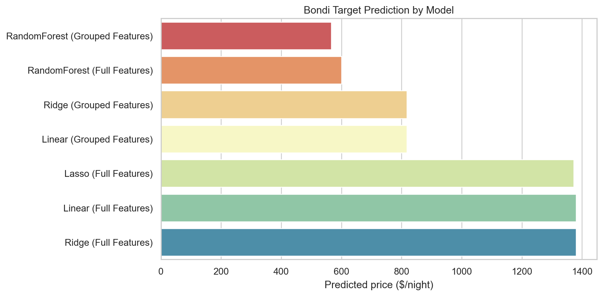

---

### G. Kết luận và khuyến nghị

1. Với full data hiện tại, mô hình nên dùng là RandomForest (không dùng HistGBR trong báo cáo này).
2. Mô hình tuyến tính có xu hướng đưa ra dự báo giá cao hơn thực tế đối với các căn biệt thự có cấu hình lớn và đặc biệt như căn Bondi.
3. Giá hiện tại **500 USD/đêm** đang bị định giá thấp hơn đáng kể so với gợi ý của mô hình tốt nhất (**khoảng 677 USD/đêm**).
4. Khuyến nghị thực thi: Chủ nhà (Host) nên mạnh dạn tăng giá theo nấc 580 -> 630 -> 670, đồng thời theo dõi occupancy, conversion, review score để chọn điểm tối ưu doanh thu cuối cùng.

Các file đầu ra để kiểm chứng:
* `analysis_bonus_full.py`
* `bonus_full_model_metrics.csv`
* `bonus_target_predictions.csv`
* `bonus_toy_linear_vs_rf.png`
* `bonus_toy_regularization_coeffs.png`
* `bonus_toy_tree_vs_forest.png`
