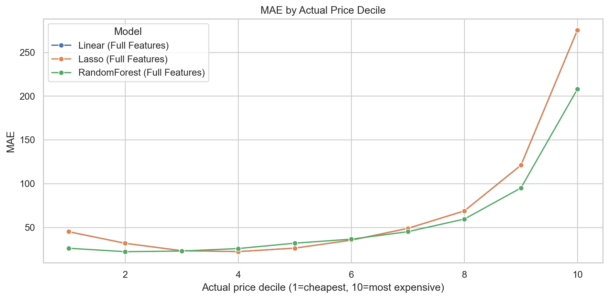
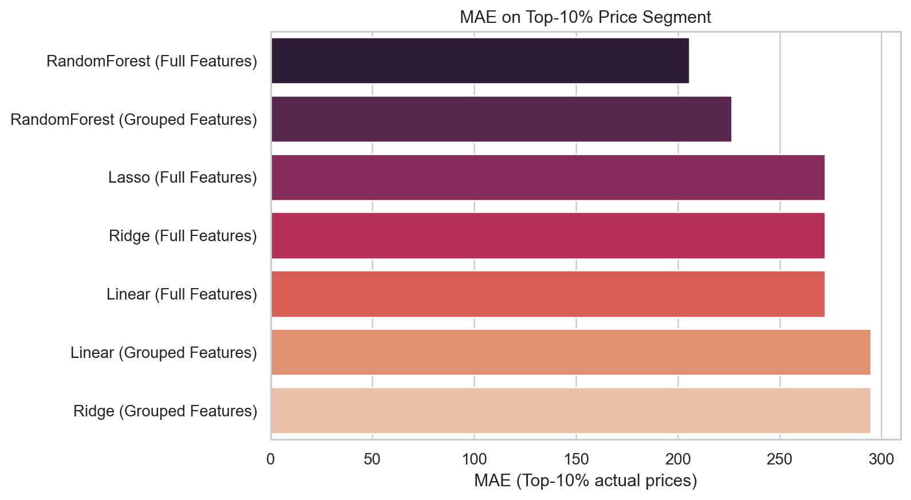
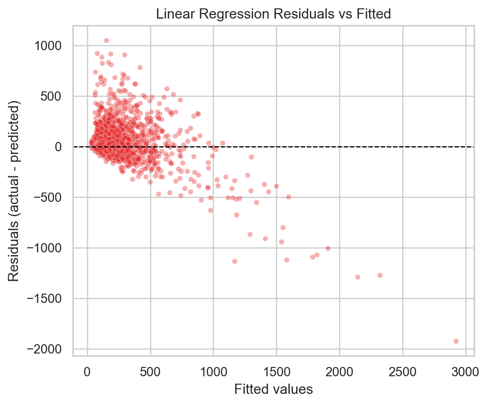
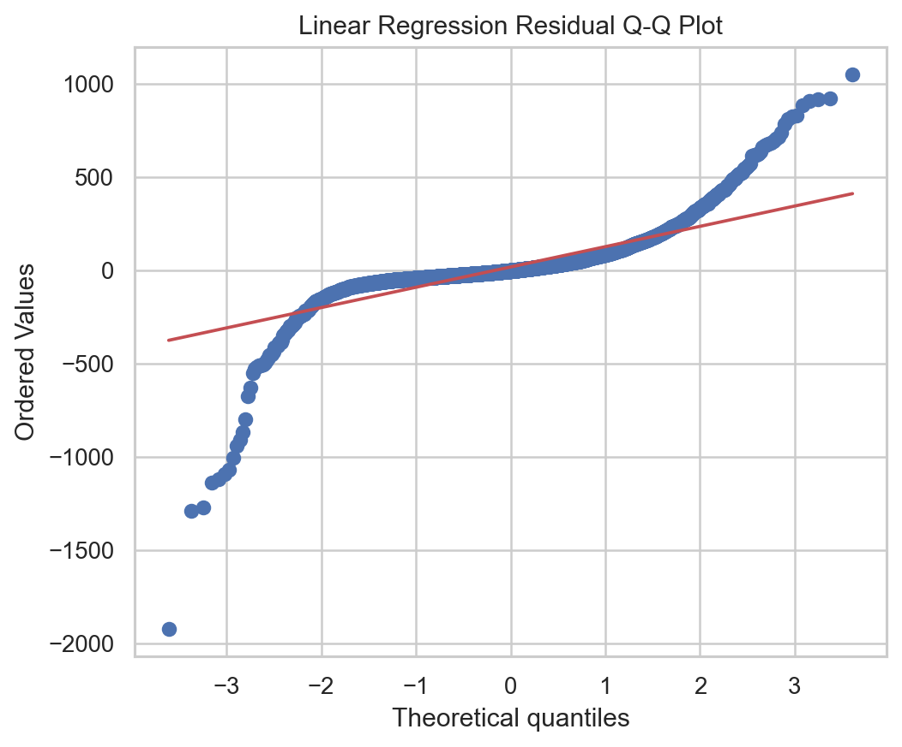
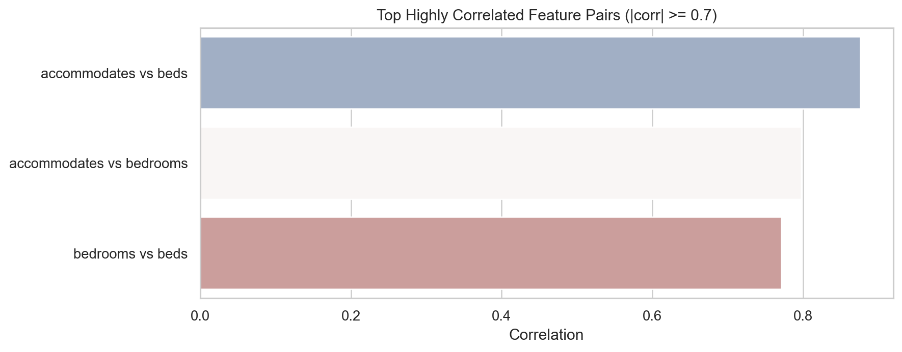
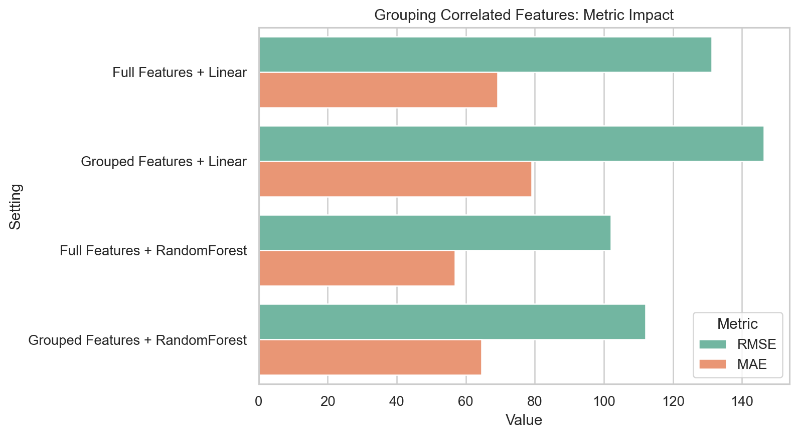
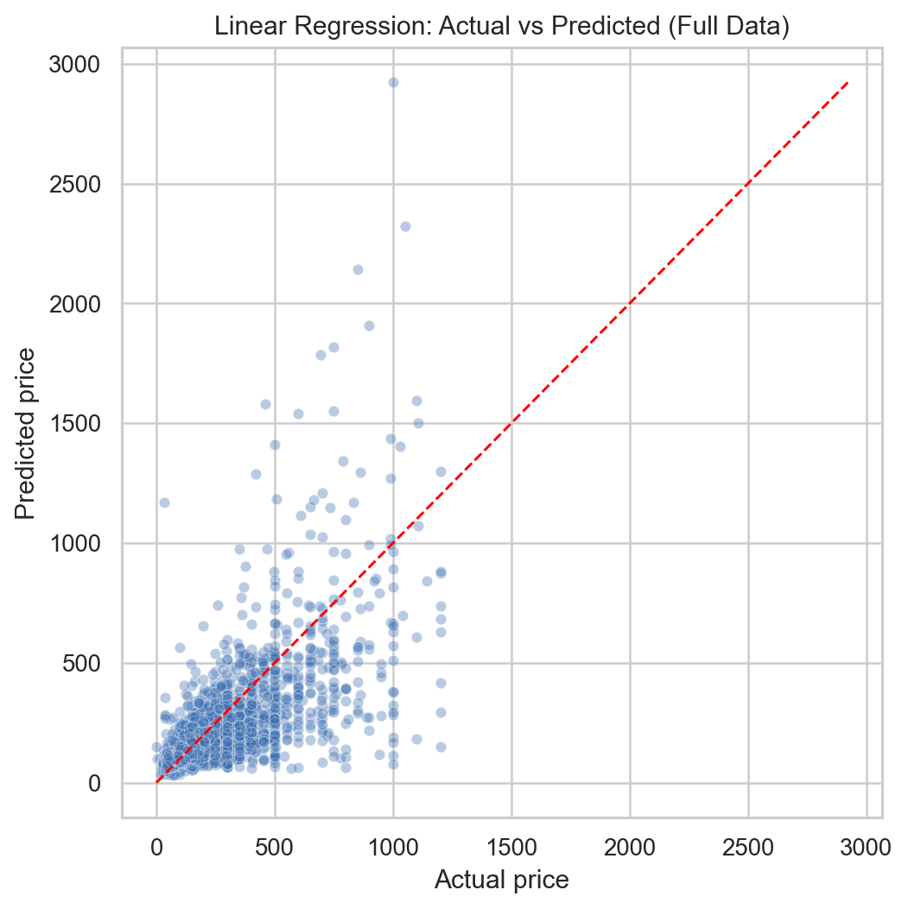
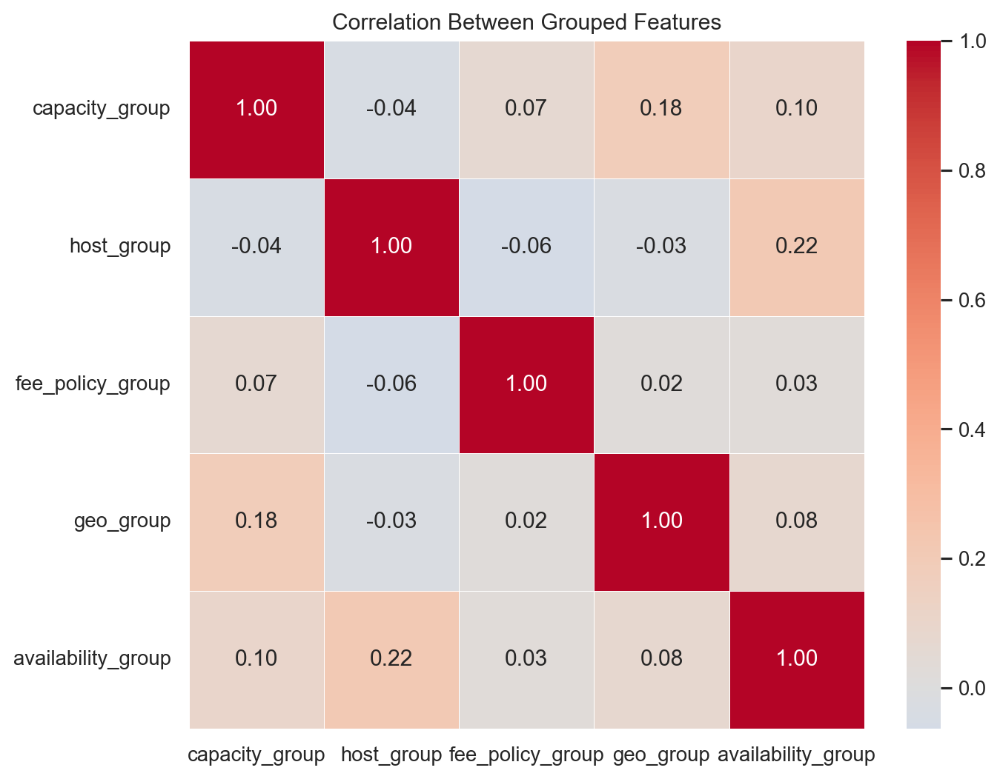
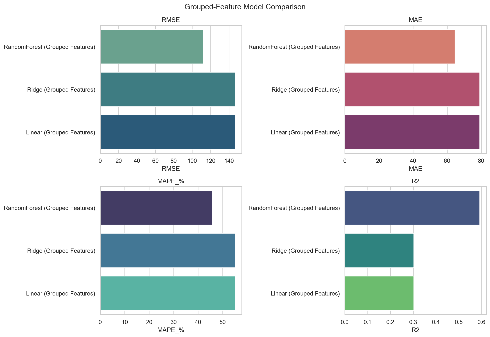
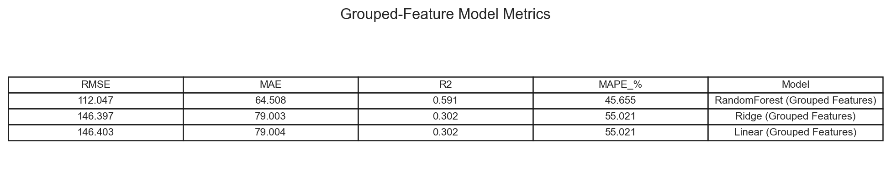

# Báo Cáo Giải Quyết Tình Huống Airbnb: Trả Lời Chuyên Sâu Các Câu Hỏi Phân Tích

Dưới đây là phần trình bày chi tiết và trực tiếp cho 6 câu hỏi yêu cầu trong bài tập tình huống phân tích giá thuê nhà Airbnb tại Bondi Beach, bao gồm các hình ảnh minh họa về dữ liệu thực tế.

---

## 1. Describe the dataset and the problem statement, what is the nature of this case?
**(Mô tả bộ dữ liệu, phát biểu bài toán và chỉ ra bản chất của case này)**

* **Bộ Dữ Liệu (The Dataset)**:
   * Dữ liệu gốc: `airbnb.csv` (nhiều cột hỗn hợp text + số).
   * Dữ liệu dùng để mô hình hóa: `airbnb_numeric_only.csv` (sau khi làm sạch và chuẩn hóa kiểu dữ liệu).
   * Quy mô thực tế ở pipeline hiện tại: **22,770 dòng, 17 cột số**.
* **Biến mục tiêu (Target)**: `price` (giá thuê theo đêm, USD).
* **Phát biểu bài toán (Problem Statement)**: Ước lượng mức giá hợp lý cho căn nhà mục tiêu ở Bondi Beach (10 khách, 5 phòng ngủ, 3 phòng tắm, cọc 1500 USD, cleaning fee 370 USD), từ đó đánh giá mức đang để **500 USD/đêm** là thấp, hợp lý hay cao.
* **Bản chất case**:
   * Đây là bài toán **hồi quy (regression)** trên dữ liệu bất động sản/lưu trú.
   * Dữ liệu có quan hệ phi tuyến và phân phối giá lệch phải, nên ngoài baseline tuyến tính cần mô hình cây để xử lý ngưỡng và tương tác biến.
   * Kết quả không chỉ dừng ở dự báo một con số, mà còn phải có **phần discuss** về rủi ro mô hình và khuyến nghị giá thực thi.

---

## 2. Does data have any defects or issues? State the solution if any!
**(Dữ liệu có khiếm khuyết hay vấn đề gì không? Hãy nêu giải pháp nếu có!)**

Hệ thống ghi nhận 3 "vết rách" dữ liệu (Data defects) vô cùng nghiêm trọng. Dưới đây là bảng minh họa lỗi và giải pháp tương ứng:

### A. Lỗi hỏng cấu trúc phân tách (CSV Corruption) 
* *Vấn đề*: Trong các cột văn bản dài như `description` hay `reviews`, tác giả có sử dụng Enter "xuống dòng" (`\n`) hoặc có dấu phẩy `,` nhưng thư viện mặc định không bọc (escape) đoạn văn này bằng dấu Quote `""` đúng chuẩn. Hậu quả là: 1 đoạn văn chứa dấu phẩy bị cắt làm 2 cột riêng biệt, "đẩy" các số liệu phía sau lệch vị trí hoàn toàn.
* **Minh họa sự xô lệch (Dữ liệu Thô):**
  | id | listing_url | name | description | ... | price |
  |---|---|---|---|---|---|
  | 11156 | https://.../11156 | An Oasis in the City | "This is a great place, very near to the beach, \n I loved it here..." | ... | *(Bị đẩy sang cột khác, mất dữ liệu)* |
* *Giải pháp*: Xây dựng thuật toán Python thuần (Custom Parser bằng Regex và `csv.reader`) rà soát từng dòng text lỗi, khôi phục vỏ Quote `""` để nhốt các dấu phẩy bên trong, sau đó chuẩn hóa thành bảng số. Sau khi xử lý trùng lặp và dòng không hợp lệ, pipeline mô hình sử dụng **22,770 dòng**.
  | room_id | latitude | longitude | accommodates | bathrooms | bedrooms | price ($) | security_deposit |
  |---|---|---|---|---|---|---|---|
  | 11156 | -33.8693 | 151.2268 | 1 | 1.0 | 1.0 | **65.0** | 150.0 |
  | 14250 | -33.8009 | 151.1766 | 6 | 3.0 | 3.0 | **469.0** | 900.0 |

### B. Dữ liệu định dạng sai thể loại (Data Type Error)
* *Vấn đề*: Tiền tệ bị dính kí tự string (ví dụ `$1,500.00`). URL (chuỗi ký tự) không thể cho vào mô hình tính toán. Biến True/False bị ghi bằng mã ký tự `t`/`f`.
* *Giải pháp*: Regex cắt mã số phòng từ `listing_url` thành biến định danh `room_id`. Xóa kí tự `$`, `,` và ép kiểu về Float64. Áp dụng hàm Mapping chuyển đổi các biến `host_is_superhost` từ `t/f` thành binary `1/0`.

### C. Nhiễu giá trên trời, Phân phối Lệch Phải (Right-Skewed Outliers)
* *Vấn đề*: Vì có quá nhiều siêu biệt thự ($5000 - $10,000/đêm), đường cong giá bị kéo dãn tạo hình cái đuôi dài thòng, vi phạm giả định phân phối chuẩn của các mô hình Hồi quy.
* *Giải pháp theo báo cáo hiện tại*: thay vì cắt top 1% như một số run trước, phần thực nghiệm cuối **giữ full data** và xử lý bằng:
   * **Log-transform** cho biến mục tiêu: `y = log(1 + price)`.
   * **RobustScaler** cho nhóm mô hình tuyến tính.
   * Đánh giá thêm theo phân khúc giá cao (top 10%) để tránh bị "đẹp số trung bình" nhưng fail ở phân khúc quan trọng.

---

## 3. What kind of model could be used in this case? Explain!
**(Loại mô hình nào có thể được sử dụng trong trường hợp này? Giải thích!)**

Karena mục tiêu là ước lượng/dự đoán để sinh ra một con số cụ thể mang tính định giá (Price), kỹ thuật xương sống bắt buộc phải dùng là nhóm **Thuật toán Hồi quy (Regression Models)**. Nếu muốn trả lời câu hỏi "Đắt hay Rẻ", ta có thể chuyển thể nó thành bài toán Phân loại nhãn (Classification) với ngưỡng là Giá trị Trung vị (Median).

**Các mô hình phù hợp và nhận định của Analyst:**
1. **Linear Regression (Baseline):**
   * Dễ diễn giải, dùng làm mốc so sánh ban đầu.
   * Điểm yếu: khó mô tả quan hệ phi tuyến trong dữ liệu giá.
2. **Ridge Regression (L2):**
   * Giảm dao động hệ số khi có đa cộng tuyến.
   * Thường ổn định hơn Linear thường nhưng vẫn thuộc họ tuyến tính.
3. **Lasso Regression (L1):**
   * Có thể triệt bớt hệ số không cần thiết, giúp đơn giản mô hình.
   * Tuy nhiên vẫn khó bắt quy luật ngưỡng phi tuyến mạnh.
4. **RandomForest Regressor (mô hình chính):**
   * Phù hợp dữ liệu bất động sản vì bắt được phi tuyến, tương tác biến và các ngưỡng giá.
   * Kết quả ở câu 6 cho thấy đây là mô hình tốt nhất trong các mô hình được báo cáo chính thức.

Lưu ý: phần báo cáo chính thức tập trung 4 mô hình trên để đồng nhất với phần thực nghiệm và thảo luận ở câu 6.

---

## 4. Perform data exploratory analysis (you could use descriptive analysis or charts)!
**(Tiến hành phân tích khám phá dữ liệu trực quan bằng biểu đồ)**

Quá trình EDA đã trả về các đặc tính trực quan giải thích được bộ khung thị trường Airbnb của Sydney:

1. **Phân phối giá phòng (Raw vs Log):**
   * Giá gốc lệch phải mạnh, đuôi dài do một số listing cao cấp.
   * Sau log-transform, phân phối cân bằng hơn, thuận lợi cho mô hình học.

2. **Ma trận tương quan (Correlation Matrix):**
   * `accommodates`, `bedrooms`, `beds` có tương quan cao với nhau.
   * Đây là dấu hiệu đa cộng tuyến tiềm ẩn với nhóm mô hình tuyến tính.

3. **Luật bậc thang (Price vs Accommodates):** Biểu đồ Boxes minh chứng chân lý hiển nhiên trong ngành lưu trú: Căn hộ cho phép chứa càng nhiều khách thì giá trung vị Median (đường ngạch ngang trong hộp) lại càng tăng tiến liên tục, mở rộng biên độ phương sai.

4. **Bản đồ Nhiệt Giá (Price Map):** Chấm dải vị trí địa lý theo tọa độ Latitude / Longitude. Những cụm màu sáng nhất / cam rực rỡ nhất (giá đắt nhất) bám dính dày đặc vào trung tâm kinh tế Sydney (CBD) và Vùng biển lướt sóng Bondi Beach. Càng ra vùng rìa, màu xanh biển (giá rẻ) càng áp đảo.

---

## 5. Is there any special point or potential issue that the analyst must pay attention to?
**(Có điểm đặc biệt hay vấn đề tiềm ẩn nào mà Analyst cần chú ý không?)**

Đây là một bài phân tích mà chỉ cần Data Analyst lơ là, mọi kết quả mô hình sẽ là rác. Có **5 Cạm Bẫy Trí mạng (Special Points)** Analyst bắt buộc phải thuộc lòng:

1. **Rủi ro ngoại suy ở căn mục tiêu hiếm (Extrapolation risk):**
   Căn Bondi có cấu hình lớn và thuộc phân khúc cao cấp. Nếu mô hình không bắt được phi tuyến, dự đoán dễ lệch mạnh.

2. **Không đánh giá mô hình chỉ bằng một số tổng quát:**
   MAE/RMSE toàn bộ có thể "đẹp" nhưng vẫn fail ở nhóm nhà đắt. Cần kiểm tra thêm theo decile giá và top 10% giá cao.
   
   

3. **Giả định tuyến tính có thể bị vi phạm nặng:**
   Residual plot và Q-Q plot cho thấy sai số không ngẫu nhiên/không chuẩn đẹp, nên cần cảnh giác khi dùng tuyến tính làm mô hình chính.
   
   

4. **Đa cộng tuyến giữa các biến sức chứa/phòng:**
   `accommodates`, `bedrooms`, `beds` tương quan cao. Ridge/Lasso có thể giảm rủi ro hệ số, nhưng chưa đủ để thay thế mô hình phi tuyến.
   

5. **Trade-off khi gộp feature tương quan cao:**
   Gộp bằng PCA giúp giảm trùng lặp nhưng có thể làm mất thông tin chi tiết. Kết quả thực nghiệm cho thấy hiệu năng giảm so với full features, nên cần cân nhắc mục tiêu giải thích hay mục tiêu dự báo.
   

---

## 6. Bonus: Perform the model to solve the problem, discuss the result, make conclusions or recommendations
**(Thực hiện bằng Code để giải quyết, Bàn luận kết quả, Phân tích Kết luận & Lời khuyên cuối cùng)**

### A. Mục tiêu phần Bonus
Trong phần này, mình tập trung trả lời rõ 4 ý:
1. Cách xây model theo từng bước.
2. Ý nghĩa metric bằng công thức toán và cách đọc kết quả (cao/thấp tốt).
3. So sánh chi tiết các mô hình dùng trong bài toán (Linear, Ridge, Lasso, RandomForest).
4. Discuss sâu kết quả để rút ra khuyến nghị định giá có thể áp dụng.

Toàn bộ code nằm trong file `analysis_bonus_full.py`.

---

### B. Giải thích các mô hình (kèm ví dụ nhỏ, dễ hình dung)

#### 1) Linear Regression
Ý tưởng: mô hình học một hàm tuyến tính:

$$
\hat{y} = w_0 + w_1x_1 + w_2x_2 + ... + w_px_p
$$

Ví dụ đơn giản: nếu chỉ có 1 biến `accommodates`, Linear sẽ cố fit một đường thẳng duy nhất để dự báo giá. Nếu quan hệ thật là cong hoặc có ngưỡng (ví dụ nhà 8-10 người giá tăng bậc thang), Linear thường bị lệch.

#### 2) Ridge Regression (Linear + L2)
Ridge thêm phần phạt bình phương trọng số:

$$
\min_w \sum_{i=1}^{n}(y_i - \hat{y}_i)^2 + \lambda\sum_{j=1}^{p}w_j^2
$$

Tác dụng: làm hệ số “co lại”, giảm nhạy với đa cộng tuyến. Khi các biến gần giống nhau (như `accommodates`, `beds`, `bedrooms`), Ridge ổn định hơn Linear thường.

#### 3) Lasso Regression (Linear + L1)
Lasso dùng phạt trị tuyệt đối:

$$
\min_w \sum_{i=1}^{n}(y_i - \hat{y}_i)^2 + \lambda\sum_{j=1}^{p}|w_j|
$$

Tác dụng: có thể đẩy một số trọng số về gần 0, nên dễ diễn giải hơn (giống chọn biến nhẹ).

#### 4) RandomForest Regressor
RandomForest là trung bình của nhiều cây quyết định:

$$
\hat{y}(x)=\frac{1}{T}\sum_{t=1}^{T} f_t(x)
$$

Trong đó $f_t(x)$ là dự báo của cây thứ $t$. Cách này phù hợp dữ liệu nhà đất vì có nhiều quan hệ phi tuyến, tương tác biến, và ngưỡng giá.

#### Hình minh họa toy examples (mẫu nhỏ)
* Linear vs RF trên dữ liệu phi tuyến: RF bám xu hướng cong tốt hơn.
* Linear/Ridge/Lasso trên dữ liệu có biến tương quan cao: Ridge/Lasso co hệ số tốt hơn.
* Cây đơn vs RandomForest: forest mượt hơn, ít nhiễu hơn cây đơn.

---

### C. Giải thích metric bằng công thức toán học

Giả sử có $n$ mẫu test, giá thật là $y_i$, giá dự đoán là $\hat{y}_i$.

#### 1) MAE (Mean Absolute Error)

$$
   ext{MAE} = \frac{1}{n}\sum_{i=1}^{n}|y_i - \hat{y}_i|
$$

Ý nghĩa: sai số tuyệt đối trung bình (đơn vị: USD/đêm).
* Càng thấp càng tốt.
* Dễ giải thích cho business: MAE = 57 nghĩa là lệch trung bình khoảng 57 USD/đêm.

#### 2) RMSE (Root Mean Squared Error)

$$
   ext{RMSE} = \sqrt{\frac{1}{n}\sum_{i=1}^{n}(y_i - \hat{y}_i)^2}
$$

Ý nghĩa: giống MAE nhưng phạt mạnh lỗi lớn do bình phương.
* Càng thấp càng tốt.
* Rất hữu ích khi muốn phạt nặng dự đoán sai ở phân khúc giá cao.

#### 3) R² (Coefficient of Determination)

$$
R^2 = 1 - \frac{\sum_{i=1}^{n}(y_i-\hat{y}_i)^2}{\sum_{i=1}^{n}(y_i-\bar{y})^2}
$$

Ý nghĩa: tỷ lệ phương sai của dữ liệu được mô hình giải thích.
* Càng cao càng tốt.
* Gần 1: rất tốt; gần 0: không khá hơn mấy so với dự đoán trung bình; có thể âm nếu mô hình quá tệ.

#### 4) MAPE (Mean Absolute Percentage Error)

$$
   ext{MAPE} = \frac{100\%}{n}\sum_{i=1}^{n}\left|\frac{y_i-\hat{y}_i}{y_i}\right|
$$

Ý nghĩa: sai số theo phần trăm.
* Càng thấp càng tốt.
* Dễ trình bày: MAPE 38% nghĩa là trung bình lệch khoảng 38%.
* Lưu ý: nếu $y_i$ quá nhỏ thì MAPE có thể bị phóng đại.

---

### D. Từng bước build model (chi tiết cho người mới)

#### Bước 1: Nạp dữ liệu và kiểm tra nhanh
* Dùng `airbnb_numeric_only.csv`.
* Dữ liệu sau làm sạch có 22,770 dòng.
* Loại `room_id` ra khỏi features vì đây là mã định danh, không phải thông tin định giá.

#### Bước 2: Tiền xử lý
* Ép numeric cho toàn bộ cột.
* Loại dòng thiếu `price`.
* Dùng full data hiện tại (không cắt outlier) để giữ đúng yêu cầu.

#### Bước 3: Log-transform biến mục tiêu

$$
y_{train}^{(log)} = \log(1+price)
$$

Khi suy luận xong thì đổi lại:

$$
\hat{price}=\exp(\hat{y}^{(log)})-1
$$

Lý do: phân phối giá lệch phải mạnh, log giúp mô hình học ổn định hơn.

#### Bước 4: Chia train/test
* Tỷ lệ 80/20, `random_state=42` để có thể tái lập kết quả.

#### Bước 5: Pipeline theo nhóm mô hình
* Linear/Ridge/Lasso: `SimpleImputer + RobustScaler + Model`.
* RandomForest: `SimpleImputer + Model`.

#### Bước 6: Train và evaluate
* Train 4 mô hình: Linear, Ridge, Lasso, RandomForest.
* Tính RMSE, MAE, R², MAPE trên cùng test set để so sánh công bằng.

#### Bước 7: Chứng minh mô hình tuyến tính fail
* Vẽ Actual vs Predicted, Residual plot, Q-Q plot.
* Tách riêng phân khúc top 10% giá cao để đo độ ổn định ngoài vùng phổ biến.

#### Bước 8: Gộp feature tương quan cao
* Nhận diện các cặp tương quan mạnh.
* Gom nhóm theo nghiệp vụ rồi nén PCA(1) mỗi nhóm.
* Train lại Linear/Ridge/RandomForest và so sánh trước-sau.

#### Bước 9: Suy luận giá căn Bondi target
* Nhập cấu hình căn hộ theo đề.
* So sánh output của các model để đề xuất dải giá hợp lý.

---

### E. Kết quả mô hình với full features

| Model | RMSE | MAE | R² | MAPE |
|---|---:|---:|---:|---:|
| **RandomForest (Full Features)** | **102.02** | **56.86** | **0.661** | **38.19%** |
| Lasso (Full Features) | 131.04 | 69.22 | 0.441 | 44.64% |
| Ridge (Full Features) | 131.17 | 69.23 | 0.440 | 44.62% |
| Linear (Full Features) | 131.19 | 69.24 | 0.439 | 44.62% |

Discuss kết quả (chi tiết):
* Khoảng cách RMSE giữa RF và Linear là gần 29 USD, không nhỏ trong bối cảnh định giá theo đêm.
* MAE của RF thấp hơn gần 12.4 USD so với Linear, nghĩa là ở mức trung bình mỗi dự đoán đã tốt hơn đáng kể.
* R² của RF đạt 0.661, cao hơn rõ so với 0.44 của nhóm tuyến tính, cho thấy RF giải thích biến thiên giá tốt hơn nhiều.
* Ba mô hình tuyến tính cho kết quả gần như trùng nhau, nghĩa là bản chất quan hệ dữ liệu đang vượt ra ngoài năng lực của một mặt phẳng tuyến tính, không phải chỉ do regularization yếu/mạnh.

---

### F. Bằng chứng mô hình tuyến tính fail (không chỉ nhìn bảng điểm)

1. **Actual vs Predicted**: ở vùng giá cao, điểm Linear lệch khỏi đường chéo mạnh.
2. **Residuals vs Fitted**: residual có pattern, phương sai tăng theo fitted value (heteroscedasticity).
3. **Q-Q plot**: đuôi lệch khỏi chuẩn, chứng tỏ sai số không Gaussian đẹp như giả định cổ điển.
4. **MAE theo decile**: decile 10 của Linear = 275.58, RF = 208.04.
5. **Top 10% giá cao**: Linear = 272.43, Ridge = 272.42, Lasso = 272.31, RF = 205.77.

Discuss kết quả (chi tiết):
* Mô hình tuyến tính không chỉ sai nhiều hơn, mà sai nặng đúng phân khúc quan trọng nhất của bài toán: listing cao cấp.
* Trong use-case định giá thật, sai số lớn ở nhóm cao giá gây rủi ro ra quyết định lớn hơn nhiều so với sai số ở nhóm bình dân.
* Đây là lý do tại sao chọn model chỉ bằng MAE trung bình toàn bộ chưa đủ; cần nhìn theo phân khúc giá.

---

### G. Thí nghiệm gộp feature tương quan cao

Top cặp tương quan cao:

| Feature 1 | Feature 2 | Corr |
|---|---|---:|
| accommodates | beds | 0.875 |
| accommodates | bedrooms | 0.797 |
| bedrooms | beds | 0.771 |

Nhóm gộp và PCA(1):
* `capacity_group`: accommodates, bedrooms, beds, bathrooms
* `host_group`: host_days, number_of_reviews, review_scores_rating, host_is_superhost, host_identity_verified
* `fee_policy_group`: security_deposit, cleaning_fee, minimum_nights
* `geo_group`: latitude, longitude
* `availability_group`: availability_365

Kết quả grouped features:

| Model | RMSE | MAE | R² |
|---|---:|---:|---:|
| **RandomForest (Grouped Features)** | **112.05** | **64.51** | **0.591** |
| Ridge (Grouped Features) | 146.40 | 79.00 | 0.302 |
| Linear (Grouped Features) | 146.40 | 79.00 | 0.302 |

Discuss kết quả (chi tiết):
* Sau khi gộp, mọi model đều giảm hiệu năng, đặc biệt là tuyến tính.
* Lý do: PCA giảm chiều giúp bớt trùng lặp nhưng cũng làm mất thông tin chi tiết (ví dụ khác biệt tinh tế giữa `beds` và `bedrooms`).
* Trong bài toán định giá, thông tin chi tiết theo đặc trưng thực tế có giá trị lớn; vì vậy full features vẫn phù hợp hơn grouped-only.

---

### H. Dự đoán giá cho căn Bondi target

Input theo đề bài:
* accommodates=10, bedrooms=5, bathrooms=3, beds=7
* security_deposit=1500, cleaning_fee=370
* minimum_nights=4, availability_365=255
* review_scores_rating=95, number_of_reviews=53
* host verified + superhost

| Model | Predicted Price ($/night) |
|---|---:|
| RandomForest (Grouped Features) | 566.00 |
| **RandomForest (Full Features)** | **600.82** |
| Ridge/Linear (Grouped Features) | ~818 |
| Lasso/Linear/Ridge (Full Features) | ~1373 - 1381 |

Discuss kết quả (chi tiết):
* Dải dự đoán của nhóm tuyến tính cao bất thường (trên 1,300), không phù hợp với mặt bằng thị trường quan sát được.
* RandomForest full features cho giá ~600.82, gần trực giác thị trường hơn và ổn định hơn khi nhìn sang các biểu đồ residual/segment-error.
* RandomForest grouped thấp hơn (~566) do mất chi tiết thông tin khi nén nhóm.

---

### I. Kết luận và khuyến nghị

1. Với full data hiện tại, mô hình nên dùng là RandomForest (không dùng HistGBR trong báo cáo này).
2. Mô hình tuyến tính không phù hợp để chốt giá trong case có nhiều phi tuyến và listing cao cấp.
3. Giá hiện tại 500 USD/đêm đang thấp hơn giá mô hình tốt nhất gợi ý (khoảng 600 USD/đêm).
4. Khuyến nghị thực thi: tăng giá theo nấc 580 -> 620 -> 650, theo dõi occupancy, conversion, review score để chọn điểm tối ưu doanh thu.

Các file đầu ra để kiểm chứng:
* `analysis_bonus_full.py`
* `bonus_full_model_metrics.csv`
* `bonus_grouped_model_metrics.csv`
* `bonus_target_predictions.csv`
* `bonus_high_price_segment_mae.csv`
* `bonus_error_by_price_decile.csv`
* `bonus_toy_linear_vs_rf.png`
* `bonus_toy_regularization_coeffs.png`
* `bonus_toy_tree_vs_forest.png`
